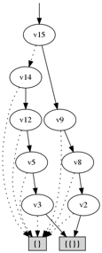

JDD mini tutorial
*****************

Getting started
---------------

To see if everything works correct, enter JDD directory and execute the following commands::

    $ ./gradlew build
    $ java -cp build/classes/java/main/ jdd.examples.BDDQueens 8
    BDD-Queen	Solutions=92.0	N=8	mem=0.77	time=46

What we just did was to run the BDD version of the "N Queens" example, which is included in the source code.

At this point, you should also see a freshly created JAR file under build/libs/.
Unless you plan to use maven/gradle, you should manually add this file to your project.

BDD tutorial
************

This part explains the basic BDD operations. It assumes however that you are familiar with BDDs & co.

**Creating a BDD manager**

The first thing to do is to create a BDD manager, which will hold all your variables and BDDs.
You may have several BDD managers in the same applications. But you cannot directly exchange information between them.

To create your BDD manager, you must specify how large the initial node table and cache are. In this example we will use 10000 and 1000::

  import jdd.bdd.*;
  ...
  BDD bdd = new BDD(10000,1000);

**Allocating variables**

To do anything interesting you first need some BDD variables. BDD variables are in JDD represented by Java integers::

  int v1 = bdd.createVar();
  int v2 = bdd.createVar();
  int v3 = bdd.createVar();

Also, there are two special BDD variables that you do not need to allocate. These two are the boolean TRUE and FALSE. They are given the Java integer values 1 and 0.

**BDD operations**

BDD operations are carried out by simply calling the corresponding function in the manager::

  // note: this is actually wrong, see reference-counting below
  int x = bdd.and(v1,v2);
  int y = bdd.xor(v1,v3);
  int z = bdd.not(v2);

You have now created three BDDs representing (v1 AND v2), (v1 XOR v3) and (NOT v2).

**Reference counting**

Each BDD has a reference count. if this number is zero, your BDD may be removed by the garbage collector. The rule of thumb when working with BDDs is to reference your trees as soon as you get them, then de-reference them when you don need them anymore and they will be removed by the garbage collector at some future point::

  // note: this is still wrong, see below
  bdd.ref(x);
  bdd.ref(y);
  bdd.ref(z);

And when you are done with them, you just do this::

  bdd.deref(z);

As garbage collection can happen at any time, it is important that BDDs are references as soon as possible.
Hence the previous example was incorrect and the right way to do it would be something like this::

  // note: this is the correct way to do BDD operations
  int x = bdd.ref( bdd.and(v1,v2) );
  int y = bdd.ref( bdd.xor(v1,v3) );
  int z = bdd.ref( bdd.not(v2) );

**Examining BDDs**

It might be useful to actually see your BDDs. You can print the BDD as a set or a cube::

  bdd.printSet(y);
  0-1
  1-0

  bdd.printCubes(y);
   v3
   v1

However, the best way to visualize a (small) BDD is to draw it.
To do this, JDD uses the "graphviz" tool "dot" which must be installed in your system and available from your shell prompt [i.e. in your $PATH]::

  bdd.printDot("x", x);
  bdd.printDot("y", y);
  bdd.printDot("v1", v1);

**Quantification**

To use the existential and universal quantifiers (exists and forall - ∃ and ∀) you first need to formally define the quantified variables as a cube.
For example, lets compute (x2 = forall c. x) where c uses the variables v1 and v2::

  int cube = jdd.ref( jdd.and(v1,v2) );
  int x2 = jdd.ref( jdd.forall(x,cube) );

The exists(x,c) function works similarly. Furthermore, the relProd(x,y,c) function efficiently computes the relational product,  (Exists c. x AND y).

There also exists a createCube function that you might find useful.

**Variable substitution**

It is sometimes desired to substitute variables in a tree. To do this, you first need formally define your permutation::

  int []p1 = new int[]{ v1 };
  int []p2 = new int[]{ v2 };
  Permutation perm1 = bdd.createPermutation(p1, p2);
  Permutation perm2 = bdd.createPermutation(p2, p1);

Now we have two permutations to change from v1 to v2 and vice versa using the replace() function::

  int v12 = bdd.ref( bdd.replace( v1, perm1) );
  int v21 = bdd.ref( bdd.replace( v2, perm2) );

**Next steps**

At this point you should have a basic understanding of how the library works.
Have a look at the included examples to learn how all this can be used to solve real problems.

Z-BDD Tutorial
**************

This tutorial demonstrates basic Z-BDD operations

Z-BDD Initialization
--------------------

There are several different Z-BDD managers in JDD, they however all work similar to the BDD manager.
The most basic Z-BDD manager is ZDD. It uses BDD-style initialization
::

  ZDD zdd = new ZDD(1000,100);

It contains all the basic operations, which are::

  int base()
  int empty()
  int subset1(int zdd, int var)
  int subset0(int zdd, int var)
  int change(int zdd, int var)
  int union(int p, int q)
  int intersect(int p, int q)
  int diff(int p, int q)

This sequence of code builds all the examples found in Minato's original paper::

  ZDD zdd = new ZDD(1000,100);
  int v1 = zdd.createVar();
  int v2 = zdd.createVar();

  int a = zdd.empty();
  int b = zdd.base();
  int c = zdd.change(b, v1);
  int d = zdd.change(b, v2);
  int e = zdd.union(c,d);
  int f = zdd.union(b,e);
  int g = zdd.diff(f,c);

Note that in contrast to BDDs, Z-BDD variables (here v1 and v2) are just numbers not Z-BDDs. You can't do things like "int a = zdd.union(v1,v2)" here!

As with BDDs, you can inspect Z-BDDs using the print functions::

  zdd.print(g);
  zdd.printSet(g);
  zdd.printCubes(g);
  7. v2: 1, 1

  { base, v2 }
  { 00, 10 }

But you will probably prefer the DOT printer printDot() ...

Additional Z-BDD operators
--------------------------

The ZDD class has some sub-classes with additional operators. These operators are used in more advanced applications. In some cases, the new operators outperform the basic Z-BDD operators, see for example the N Queens applet where a ZDD and ZDDCSP are compared.

ZDD2
====

ZDD2 contains additional operations for unate cube set algebra. These operations are shown below::

  int mul(int p, int q)
  int div(int p, int q)
  int mod(int p, int q)

ZDDCSP
======

ZDDCSP adds extra ZDD operations for CSP problems. it is based on 'On the properties of combination set operations', by Okuno, Minato and Isozaki::

  int restrict(int f, int c)
  int exclude(int f, int c)
  int exclude_slow(int f, int c)

ZDDGraph
========

ZDDGraph is intended to [in near future] include common ZDD operations used in graph algorithms, as explained in Coudert's paper::

  int allEdge(int from, int to)
  int allEdge()
  int noSubset(int f, int c)
  int noSupset(int f, int c)
  int maxSet(int x)

Graphviz dot support
********************

Graphviz from AT&T is a public domain package for generating graphs from a textual description.

Internally, BDDPrinter.printDot() is used to generated DOT represenations and images from BDDs.
Similarly, ZDDPrinter is used when printing ZDDs.

Both in turn use the jdd.util.Dot class for operations related to dot.
You can access the Dot class and modify the way this is handled, for example you can change the output format from PNG to EPS::

    Dot.setType( Dot.TYPE_EPS);

